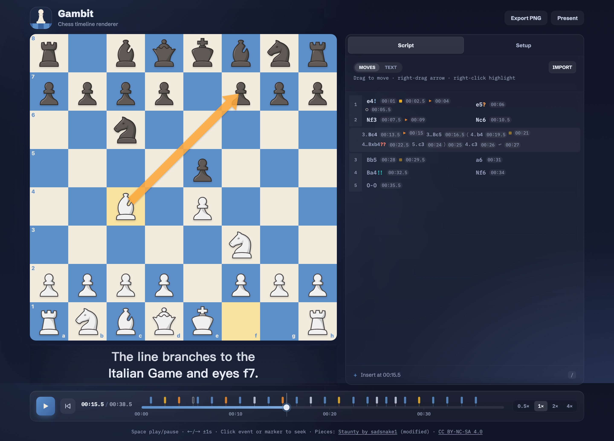

# Gambit

Chess timeline renderer. Replays a game from a timestamped script with annotations (highlights, arrows), synced SRT subtitles, a scrubber, custom FEN starts, speed controls, and a short click each time a piece lands (mutable from the transport). Built for a desktop, mouse-driven screen-recording workflow — scrub the timeline, then screen-record a clip or screenshot a frame for videos, lessons, and articles.



## Run

Requires Node.js 20.19+ (or 22.12+).

```sh
npm install
npm run dev
```

Open the URL Vite prints (typically http://localhost:5173).

## Script syntax

```
[mm:ss] e4!                 # SAN move; optional quality suffix: !!, !, ?, or ??
[mm:ss] hl d4,e4 pin        # highlight squares; optional pin lasts until cl/rs/st/fen
[mm:ss] f1->c4 pin          # arrow; pin is optional; also accepts →, "to", or "arrow"
[mm:ss] cl                  # clear annotations (also accepts "clear")
[mm:ss] rs                  # reset to the configured Start FEN (also accepts "reset")
[mm:ss] st                  # reset to the standard position (also accepts "start")
[mm:ss] fen <FEN>           # set a position (also accepts "setfen")
[mm:ss] br                  # enter a variation (also accepts "branch")
[mm:ss] ml                  # return to mainline (also accepts "mainline")
[mm:ss] rp [seconds]        # replay prior mainline moves, 0.5s each by default (also accepts "replay")
[mm:ss] mind                # enter the deterministic mind's-eye view
[mm:ss] reveal              # reveal the full board again
```

`rp` replays every successfully applied move before it that is outside all
`br` / `ml` variations. Each move takes 0.5 seconds unless `rp <seconds>` gives
a different step: 0.1–10 seconds, written with a leading digit and at most one
decimal place (`rp 1`, `rp 0.5`) so replay frames stay on the same decisecond
grid as timestamps; anything else is a script error. Resets, standard starts,
and valid FEN changes are honored without consuming a replay step. The replay
must fit before the next authored event; otherwise Gambit shows a script error
and leaves the board unchanged. Use `reveal` before `rp` when mind's-eye mode is
active.

## Board PNG export

Use **Export PNG** in the editor header, or **PNG** in Present mode, to download
the currently visible board as a 1440×1440 image. The export keeps the current
orientation, coordinates, pieces, highlights, arrows, last-move tint, checks,
capture effects, annotation badges, and mind's-eye frame. Subtitles, controls,
PGN, and in-progress editing gestures are excluded. Browser zoom and the board's
onscreen size do not change the output dimensions.

## Subtitles

Open the **Setup** tab to paste SRT text or import a `.srt` file. Subtitle cues use standard SRT time ranges and must be separated by a blank line:

```
1
00:00:01,000 --> 00:00:04,000
Central control is established.
```

## Development

```sh
npm test          # node scripts/test-regressions.mjs — not a test framework
npm run typecheck
npm run build
```

See [docs/](./docs) for contributor documentation: architecture, the script
language, editing, playback, design, testing, and asset notes.

## Credits

Staunty chess piece SVGs by sadsnake1 via Lichess, modified for Gambit
(warmer outline color; nothing else changed). See the
[piece asset notice](./public/licenses/LICENSE-pieces.txt) (CC BY-NC-SA 4.0)
for the exact changes.
That license includes a NonCommercial restriction; confirm that it covers the
intended recording/distribution, or replace the piece set before commercial use.

## License

Code is licensed under [MIT](./LICENSE).

Chess piece SVGs remain [CC BY-NC-SA 4.0](./public/licenses/LICENSE-pieces.txt);
see Credits above for the NonCommercial caveat. Fonts remain
[OFL-1.1](./public/licenses/LICENSE-fonts.txt). Chess rules are provided by
[chess.js](https://github.com/jhlywa/chess.js) under
[BSD-2-Clause](./public/licenses/LICENSE-chess.js.txt).
